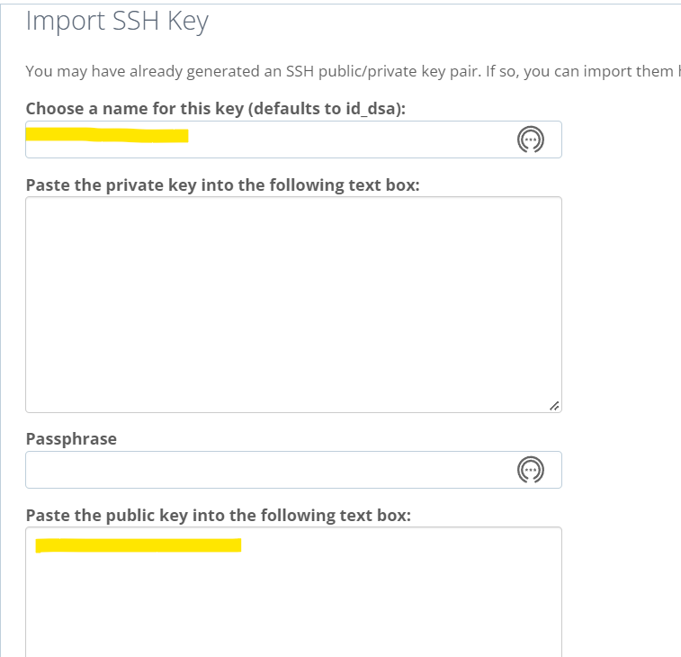

I spent a whole day figuring out how to continuously deploy WordPress theme and plugin development using GitHub while developing and running WordPress also locally. In the past, I simply used SFTP client to synchronize/upload all the changed files to hosting provider's cPanel file manager manually. But that is tedious and error prone. Moreover, also time consuming. I could finally set up a CD workflow for my WordPress development. So, I am going to just write it down here for my future self.

Let's say you are using BlueHost hosting provider for your WordPress site and want to use GitHub as version control for your theme/plugin development and deploy the code to BlueHost, then you have come to the right place. Read on...

## Prerequisites

- BlueHost hosting provider \[shared/dedicated\]. I am using a shared hosting

- **SSH Shell access to BlueHost** -

  - it is not enabled by default. Contact their support using Chat and they will enable it immediately

- GitHub account

- Basic knowledge of how to work with Git and GitHub

- Git installed on your local machine

## GitHub Repo

Login to your GitHub account and create a new repo. No need to add README file or any other file right now. You can keep this repo private if you want to.

Let's say this repo name is "**mywpsiterepo**".

Copy the HTTPS GitHub repo URL. We will need it later.

It should look something like this

```shell
https://github.com/<youruserid>/mywpsiterepo.git
```

## Local Git Repo

Since, most probably, you will want to develop/write code on your local machine and not directly on the GitHub (!), create a local git repo.

I am using VS Code terminal to create git repo. But you can use any command line tool or Git desktop app/GitHub Desktop app too.

Connect your local repo to remote GitHub repo using below command (while within the root of your local git repo directory)

```shell
git remote add origin https://github.com/<youruserid>/mywpsiterepo.git
```

## What if I want to run WordPress locally while I develop?

In that case, you might want to

- install WordPress locally \[I use Local by Flywheel\]

- initiate the local Git repo within the wp-content/ folder of this wordpress site

- add below .gitignore file to ensure you do not push complete Wordpress site code along with theme and plugins that are installed locally \[Noe this is only suggestive, and you may change it as you like\]

Note that these paths are relative to root directory of local git repo. In my case, it is the "wp-content" directory. Therefore, all paths are relative to that directory.

```gitignore
/*
.github/*
!.gitignore

!plugins
plugins/*
!plugins/dhana-plugin
!plugins/tattvahatharestapi

!themes
themes/*
!themes/twenty3-child

!themes/dhanatheme
themes/dhanatheme/node_modules
themes/dhanatheme/vendor

!mu-plugins
mu-plugins/*
!mu-plugins/tattva_custom_post_types.php
```

I found this [YoutTube video](https://youtu.be/l6uZtXb888k?t=301) helpful on this topic.

When you install Local By Flywheel, you can also download the backup of wp-content from BlueHost and then database SQL file of you live site and use that to create local WordPress site as shown in [How to Import a WordPress Site into Local - Local (localwp.com)](https://localwp.com/help-docs/getting-started/how-to-import-a-wordpress-site-into-local/). But I could never get it running locally. I continuously get "**Sorry, you are not allowed to access this site**" when I try to go into WordPress admin.

Making sure only those files you want to push to GitHub repo and deploy eventually to BlueHost, we can continue to next step.

But before that, you might want to push some initial commit to GitHub repo.

## SSH Keys on BlueHost

[This guide](https://www.bluehost.com/help/article/ssh-public-private-keys) shows how to generate SSH Keys on BlueHost and authorize them. But, then you will need to enter Passphrase which is not good in case of "rsync" \[This is what we will use to deploy from GitHub to BlueHost\].

Instead, what you can do is

- to generate RSA SSH keys using command "ssh-keygen" on your local computer

- follow the instructions, do not provider Passphrase

- Copy the public key \[location of this file is shown once the keys are generated\]. By default, on windows laptops, this is

```shell
c:/Users/<userid>/.ssh/
```

- Here, you will find 2 files => **id_rsa.pub has the public key, id_rsa has the private key**. You can open them in any text editor, but **never change their content**.

- Go to BlueHost => Advanced => SSH and then use "Import" option to import this key \[do not enter passphrase here too\]



- Authorize the key you just created

- We will use the private key when we create GitHub action later

## Before we create GitHub Action

- Make sure SSH Shell access enabled to your BlueHost account

- Go to "Advanced" section of your BlueHost account and find the user ID you need to use for SSH access. It is usually under "General Information" => "Current User" section. Let's say it is "myadminuser"

- Your SSL URL would be something like this  
   _myadminuser@mydefaultdomain.com_

- Or you can also find the IP address of your hosting by going to  
   Advanced => General Information => Server Information \[link\]  
   Let's say it is 192.123.22.33  
   Then you SSL URL would be _myadminuser@192.123.22.33_

- Make sure you have securely saved the private key you generated \[do not share this with anybody\]. Hence the name "private" key.

## GitHub Action for CD

[This guide on CSS Tricks is very elaborate and I found it very useful.](https://css-tricks.com/continuous-deployments-for-wordpress-using-github-actions/) So, I am not going to explain again. I assume you will follow that and especially create the "secrets" named "DEPLOY_KEY" in your repo.

In my case I changed a couple of things:

- Deploy push to "main" branch to keep things simple \[single person team here\]

- No nodejs dependencies in my case

- Be extremely careful with the "--delete" part of rsync \[It will delete all files/folders from your destination directory on BlueHost that are not there in your GitHub repo\]. Note that we are not pushing any standard or 3rd party theme or plugin files to GitHub repo. So, they will be deleted if you use this command. I highly encourage you remove it if your destination directory on BlueHost is just "wp-content"

However, if your destination directory is your custom/child theme directory, then you can still keep "--delete" option.

That said, my GitHub Action YAML file looks like this

```yaml
name: Deployment
on:
  push:
    branches: [main]
jobs:
  deploy:
    runs-on: ubuntu-latest
    steps:
      - uses: actions/checkout@v2
      - name: Sync
        env:
          dest: "dhananja@dhananjayhegde.in:/home2/dhananja/public_html/wp-content/"
        run: |
          echo "${{secrets.DEPLOY_KEY}}" > deploy_key
          chmod 600 ./deploy_key
          rsync -chav \
            -e 'ssh -i ./deploy_key -o StrictHostKeyChecking=no' \
            --exclude /deploy_key \
            --exclude /.git/ \
            --exclude /.github/ \
            --exclude /node_modules/ \
            ./ ${{env.dest}}
```

## Finally, the development workflow

To keep things smooth, you may follow this workflow for development and then deployment. Of course, test automation is not part of this yet. Feel free to include it your workflow.

Every time you want make some change/develop new feature, you can:

- Pull latest changes from Report repo into your local repo main/master branch

```shell
git pull origin main
```

- Checkout to a new feature branch

```shell
git checkout -b feature/some-new-theme
```

- do the development, make frequent commits etc.

- when you are ready, push the feature branch \[NOT the main branch\] to remote repo

```shell
git push origin feature/some-new-theme
```

- checkout to main branch

```shell
git checkout main
```

- Logon to GitHub and go to your remote repo and the new feature branch "feature/some-new-theme"

- Find the latest commits and create a pull request

- Merge them into main branch

- With this, your GitHub action should run and deploy the site to BlueHost

- Test and ensure everything is OK

- When everything is OK, you can delete the feature branch, both on remote repo and local repo

- On your desktop \[making sure you are on the main branch\], pull latest code from remote repo

```shell
git pull origin main
```

Rinse and repeat.

That's it for today!

I am sure I will find this useful some day in future. Hope you do too.
