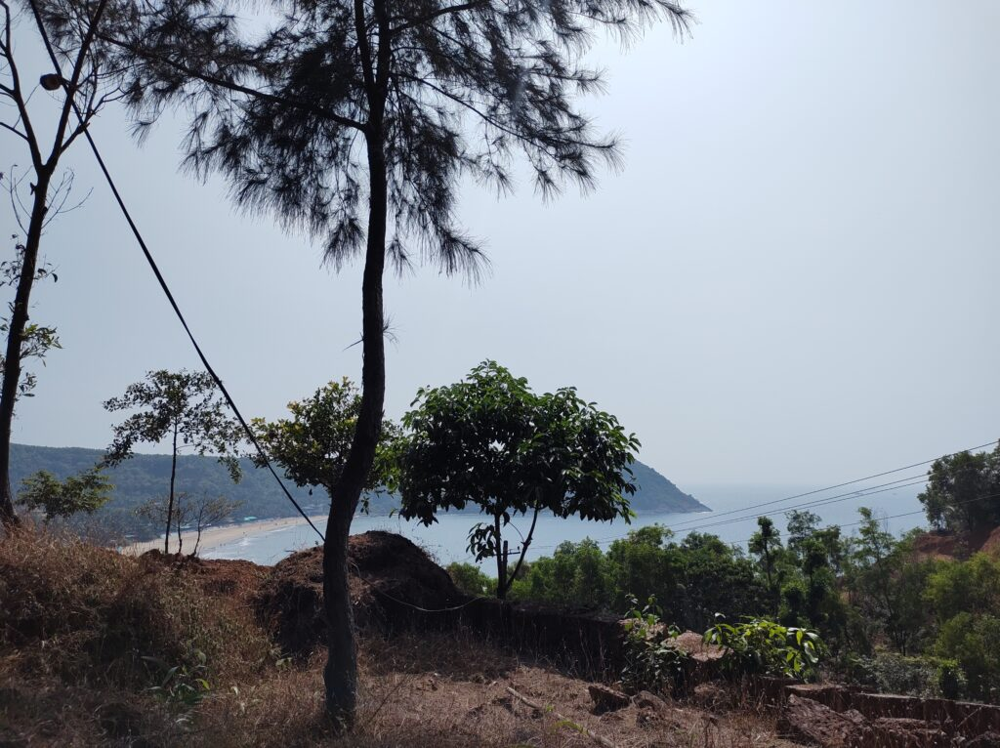
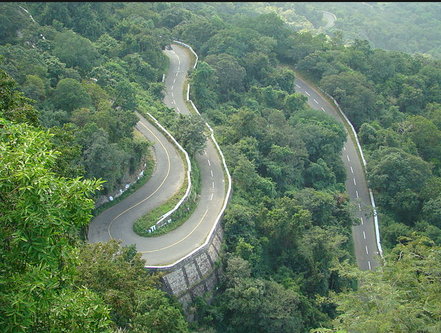
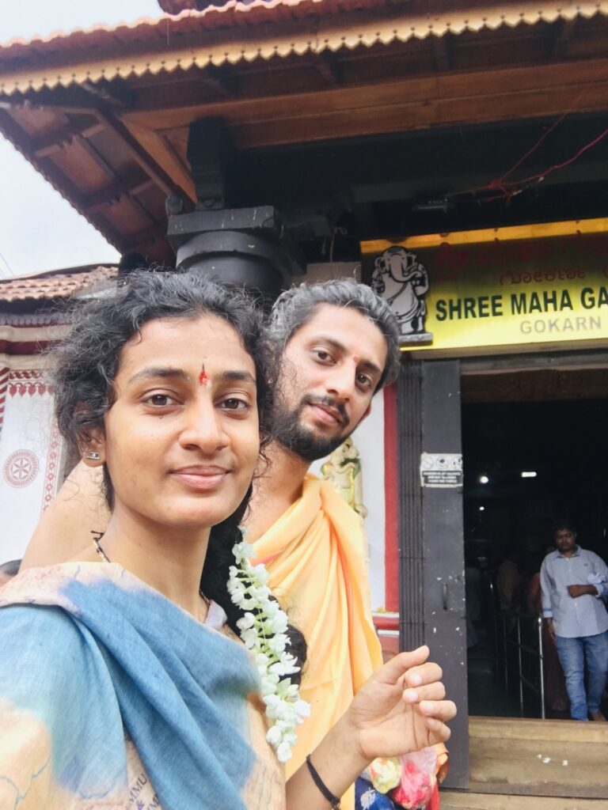
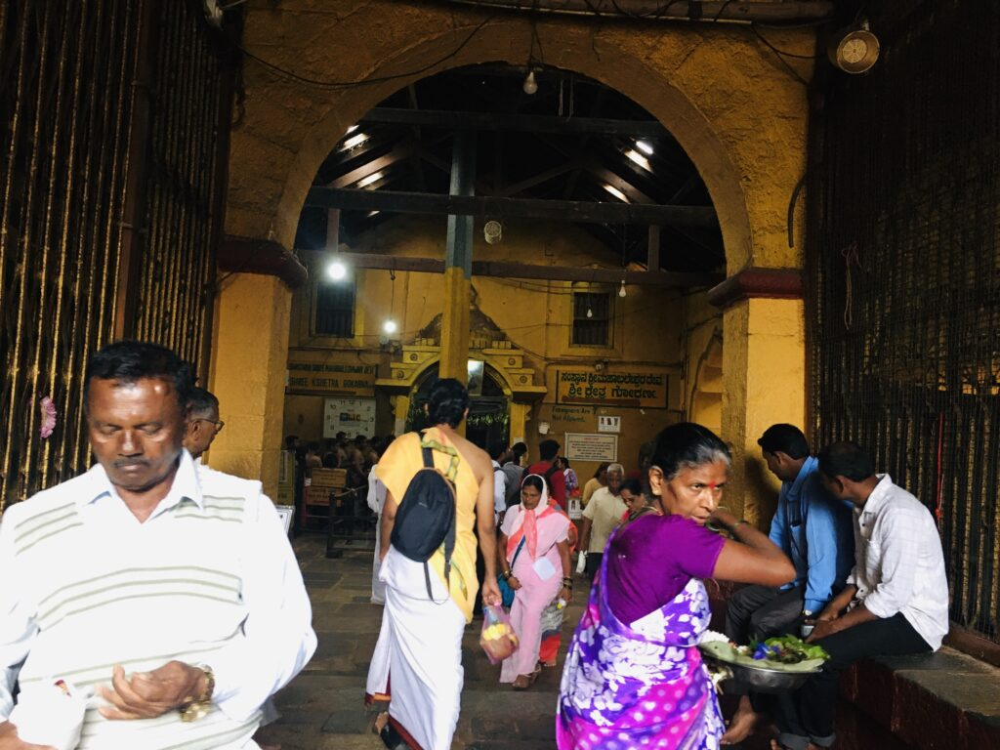
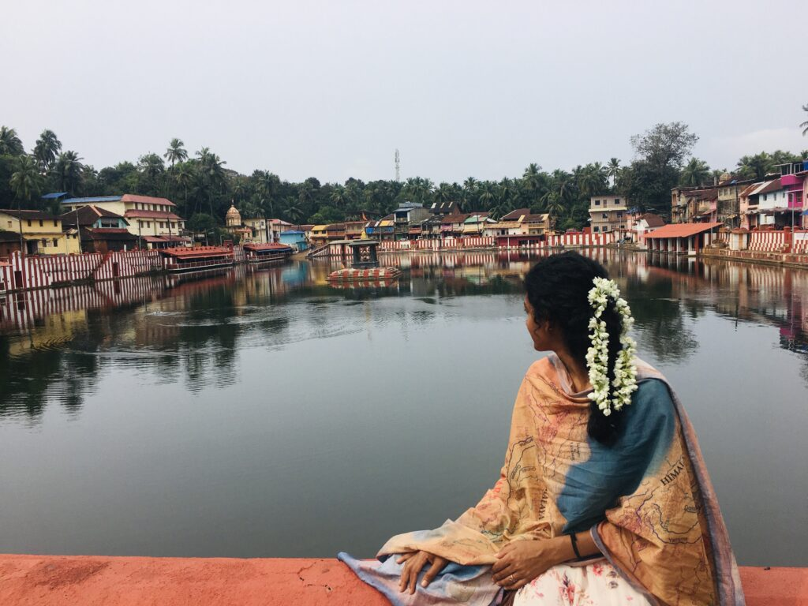
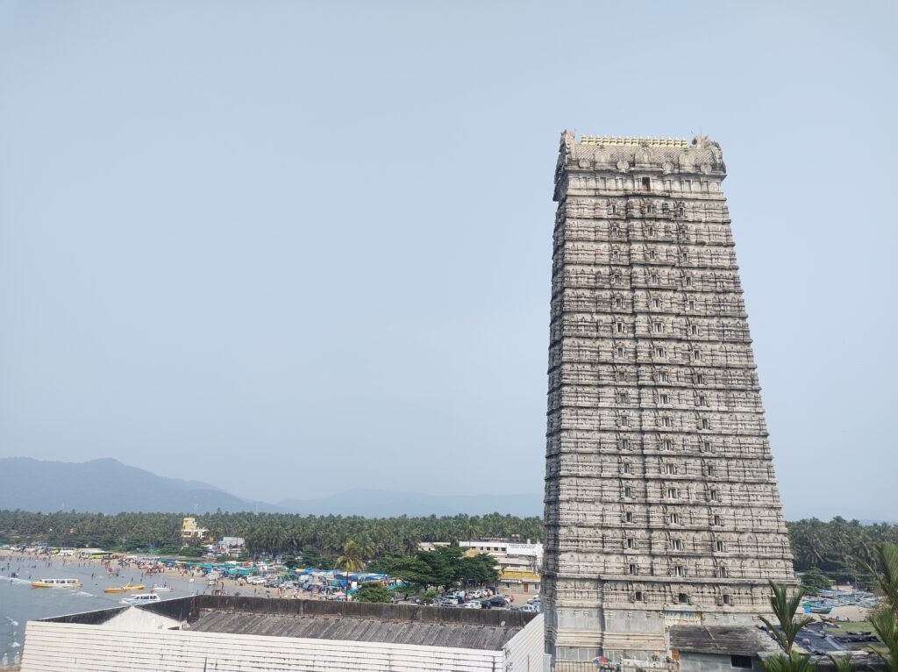
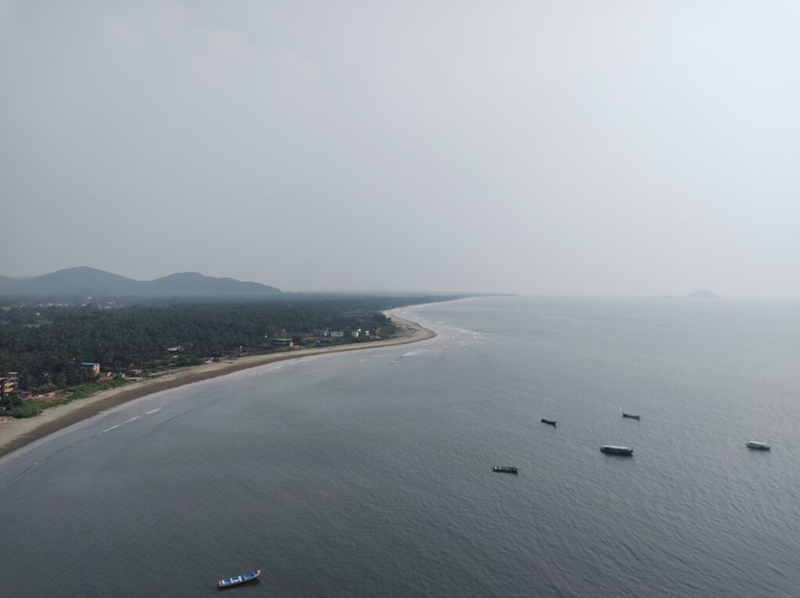
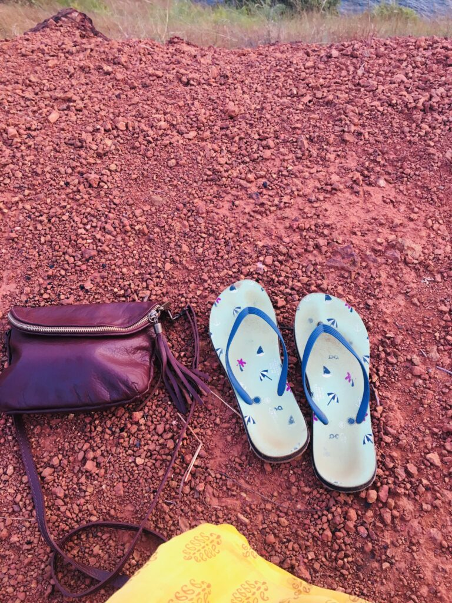

If you asked someone for a 3 Night 4 Day itinerary for Gokarna, you would invariably get something like this:

- Day 1: Visit the temple in the morning, take a dip in Koti Teertha, have lunch/prasaada at the temple, visit the main beach in the evening, go for a banana ride

- Day 2: Take a hike to Kudle Beach, go for a Jet Ski Ride, walk to Om Beach, after lunch, go to Paradise beach and then to Half Moon beach

- Day 3: Visit Yaana (about 40km) and Vibhooti Falls, visit Mirjan Fort

- Day 4: Go to Yellapur (really?), Murudeswara, Netrani Island, go for diving

That was not what we did though.

## Long story short

Because you might be a busy person, I am being kind to offer this TL;DR. Here you go:

The itinerary was like this: Get up early. Watch sunrise/go to beach. Eat breakfast. Take a nap and wait till you get hungry. Go have lunch on Kudle Beach till 4pm. Watch sunset at the beach/cliff. You are hungry again. So, back to the beach for dinner. Back to cottage and sleep before 11pm.

See? how refreshing and relaxing! 😎

## Long story longer

There are tourist places where you need to be busy, plan in detail as to what to do, when to do, where to go and what to eat well in advance.  I must tell you; Gokarna is not one of those places.  Here, you need to be lazy to enjoy what it has to offer.  By lazy, I don’t mean you to be a couch potato or spend all your days lying on a beach getting drunk.  What I mean is not to go overboard with your planning leaving no place/time to breathe.

One might wonder what a non-alcohol-drinking, non-partying, vegetarian couple do in a place like Gokarna for a vacation. That too for 4 days!

For a few months, I had been thinking to take a long vacation to go on a digital detox.  A place where there would not be any mobile signals.  A place where hardly anyone would know me.  Where, it would be easy to find something to eat to survive. Finally, my [wife](http://tattvahathayoga.com/) and I zeroed in on Gokarna after having considered Pondicherry for a while which was dropped from the list due to the returning monsoon.

I was born and brought up in a village near a town called Sirsi from where Gokarna is about 75km.  But I had not been there in about 20 years.  Only times I visited Gokarna were when someone in the family died. That is when the family would go there to drop the “asthi” (remains of one’s skeletons after cremation).  Needless to say, I was very young, and all previous visits were to the temple and the main beach in Gokarna and back home.

This time, I wanted to explore Gokarna outside of it.  But I did not want to spend all the time hopping from one place to other.

## Bengaluru to Gokarna

Just two weeks before the travel date (towards the end of November this year), I booked a hill-top cottage in [Niramaya Resort](https://www.google.com/maps/place/Niramaya+resort/@14.5335332,74.3130598,17z/data=!3m1!4b1!4m8!3m7!1s0x3bbe83ed1988fecb:0xd7b0b86f2d96c0b!5m2!4m1!1i2!8m2!3d14.5335332!4d74.3152485) on [Bookings.com](http://Bookings.com).  Kudle beach is 5 minutes from there by walk.  But the beach is visible from the portico of this cottage.  It also looked not so crowded as there was enough distance between one cottage to the other.

<figure>

<figcaption>

Kudle beach from outside the cottage

</figcaption>

</figure>

Bus journey was comfortable from Bengaluru to Gokarna.  Bus (Greenline Travels) took Bengaluru Pune Highway till Haveri and reached Gokarna via Sirsi.  Having boarded the bus at Jayanagar at around 9pm, and changing to main bus at Ananda Rao circle, I slept uninterrupted till 5:30am and only woke up when we reached Sirsi.  From there on, I kept waiting for Devimane Ghat.  Memories from childhood kept rushing back.  But it was not like how I remembered it.

Whenever we passed through Devimane Ghat by a KSRTC bus, they would stop the bus at the peak for a break where there is a small temple. Everyone would get down, enjoy the view of lush greenery of the Western Ghats and go on about their journey. It was not so this time.

<figure>

<figcaption>

Souce: Wikipedia becasue I could not take a photo from the bus

</figcaption>

</figure>

By the time we reached Gokarna, it was around 8am; a delay by 30 minutes.  Upon arriving we took an auto to Niramaya Resort.  Which was around 2 – 3km from the bus stand. I felt auto charges were a bit high for that distance (Rs. 150/-).

## First Things First on Arrival

We took a quick shower, got ready and headed outside.  I was hungry and wanted to eat something.  I had been waiting to eat something in Gokarna since the day I planned to come here.  On the way, we called up a motor bike rental and booked a scooty (Honda Activa).  After the breakfast, we went and took the motor bike for rent.  The guy at the rental shop kept one original ID with him and assured us that the Honda Activa was the new one and he had reserved it for us. It just looked old outside but apparently was new inside. By the time we filled fuel it was around 11am.

## Day 1 - Market, the Main Beach and Kudle Beach

Our first stop was the main beach which is overlooked by the Mahābaleswara temple.  Since it was a sunny day and it was getting hotter by the noon, we headed back into the market street in front of the temple enjoying the amalgamation of various aromas coming from spice shops on either side of the street.  Since it was too early for any hotels to serve lunch.  So, we headed back to our cottage and retired to hammocks for a short nap.  It was so quiet and breeze from the beach below was so soothing, nap turned into a one and half hour sound sleep.  When I woke up, I was hungry.  So, headed back into the town for lunch.  Ate something in the restaurant on the main beach and came back to the cottage.  Whole idea of this trip was to eat, sleep, rest and watch the sea. We wanted to stand by that plan.

<figure>

<figcaption>

Typical Street in Gokarna

</figcaption>

</figure>

In the evening, we walked down to the Kudle Beach.  I sat on the beach while my wife enjoyed playing in the water as the sun went down.  This is what I was hoping to do there, just sit and do nothing.

Some time around 7pm, we went into [Garden Cafe](https://goo.gl/maps/5Nv7zfhfrkwKmcUT8) by the beach which was least crowded.  Little did we know that we would end up eating at the same cafe for the rest of our stay there.

We took a corner seat and finished our dinner at our own pace.  By the time we left at around 9pm, it was still not so crowded except for a few foreign tourists who, I got to know later, were also regulars there.  We would see a few of them again and again over next couple of days.  Beach too was sparsely crowded and dark.  The sky above adorned setting moon - second day of the growing moon.  Silence was breached only by the waves and the low humming of some music from one of the beach side restaurants.

After walking on the beach for a few minutes, we called it a day, walked back to our cottage and retired to bed.

## Day 2 - Sunset from a Cliff

It was Sunday.  We initially thought of visiting the Mahābaleswara temple on that morning.  Due to my extreme level of laziness, we ended up going to Pai Hotel in front of Venkataramana Temple.  For the remaining 3 days, we would have breakfast at the same place, sitting at the same table, collectively eating almost everything on their breakfast menu.

After breakfast, we went back to cottage.  Napped till 2pm.  But, today, for lunch, instead of heading back into the town, went down to the Kudle Beach and walked into the same cafe where we ate dinner the previous day.

They waved a familiar smile at us.  We sat at the same place where we sat the previous evening.  Chatted with the guys/staffs at the cafe for a while as we ordered our lunch.  The restaurant itself does not have any music system or TV.  Why do you need either when you have the sea in front of you anyway?  But, nevertheless, some guys sitting at the other end of the restaurant did not seem to agree with this idea.  They carried their own Google Nest or something like that and played some meaningless beats all the time.  It is as though they were scared of silence swallowing them. While one tries to escape the cacophony of the city, other is afraid of the silence, so carries the noise wherever they go. While I kept thinking all these as we ate our lunch watching the waves come and go, I did little to confront them.

By the time we left, it was around 4:30pm.  Today, we wanted to walk behind the cottages and go the other side of the hill to watch the sunset.  It was a private place, so no one except those who stayed in the cottages had access to the spot.  We did not have much company for the sunset except for one more couple who must have come there not expecting to see anybody, like we did.

It was one of the most beautiful sunsets I have ever watched.  We sat at the edge of the cliff and watched the Sun going down.  It felt like we were at the edge of the world.  We kept playing “how many fishing boats can you see?” game for a while.  Ramya was humming some Rāma stotrās in low voice which added divinity to beauty. As it was Shukla Paksha (fortnight of the growing moon), it was not going to be too dark. We must have sat there for a long time before finally decided to walk back to the cottage.

I was hungry, as I am most of the time. So, we went down to the beach, but to a different restaurant where there was no one.  Except of course the restaurant owner, the chef, and the waiter.  The trio were watching something when we went inside, and I felt sorry for disturbing them.  But when I got the pizza I ordered, I felt sorry for myself for even entering the restaurant.  I struggled to eat even two slices.  The beach, the moon and the tides did not come to my aid. As I lost the appetite to eat anything after that, the pizza went into the dustbin, and I went to bed feeling sorry for having lost a God-given opportunity to have a delicious dinner.  That day and that opportunity shall never come back.

## Day 3 - Accruing some good Karma

Gokarna is one of the major Tērtha Kshetras. The linga in Mahābaleswara Temple is believed to be the Ātma Linga of Shiva. Our goal for today was to take a darshana of the main temple and visit other temples too.

My mother had enumerated all the temples one must visit as soon as she heard my plans. As per her guidance, one must first visit the Ganapati Temple which is to the South West of Mahabaleshwara Temple. Then, go around the corner to the main temple. After that is to visit the Tāmra Gauri temple behind the main temple followed by a walk to the end of Car Street to visit Sri VenkataramaNa Swāmy Temple. One must also to go to KōTi Tīrtha and take a dip to enjoy the complete puNya of going to GōkarNa. The more devoted devotees may take a dip in the Arabian Sea before going into the main temple - Mahabaleswara Temple.

Having had such detailed instructions with us we could not have missed any. So, our day 3 started with getting up before 6am, making a lemon tea (an electric kettle was provided by the cottage management, and lemon tea powder was procured by us from the market the first day which I did not mention earlier), walking to the cliff for sunrise and enjoying the tea soaking in the silence of that morning. How I wish every morning started like that. You could not have a better one than sitting by the sea and reflecting on your life and being grateful for one more such beautiful day.

This meant we reached the temple a bit late, by around 9:30am. Since we had to follow the sequence as instructed by my mother, by the time we reached the Mahabaleswar temple, there was already a long queue for the darshana. We waited in the queue for about 30 minutes to finally reach the sanctum only to get pushed out by the priest within a fraction of a second. Before we came out, Ramya had more water in her eyes than the Arabian Sea 100 meters away. This is one the few temples where devotees get to go into the Sanctum Sanctorum and touch the deity. Due to the crowd, she could not get to do that. We promised ourselves to come back early next morning. That seemed to sooth her a little bit.

<figure>

<figure>

<figcaption>

Maha Ganapati Temple

</figcaption>

</figure>

<figure>

<figcaption>

Sri Mahabaleswara Temple

</figcaption>

</figure>

<figure>

<figcaption>

Koti Teertha

</figcaption>

</figure>

</figure>

**Note:** Do not forget to buy some flowers from women selling them outside the temples.

Rest of the day went like the previous one - lunch at the Garden Cafe on Kudle Beach, sunset at the cliff, back to Garden Cafe for dinner, back to cottage, sitting outside the cottage stargazing for a while and then to bed.

## Day 4 - Unplanned trip to Murudeshwara

Next morning started before 6am and we're at the temple by 7am. But only watching one of the most beautiful sunrises from right in front of the cottage. It had rained the previous day and night a little bit and sky was clear in the morning. If you were there, you would not believe that the red ball rising from behind the Western Ghats was in fact the Sun. The camera failed to capture what I (eye) could see.

At the temple, we got to go inside unhurriedly this time. There was less crowd due to that being very early and being a weekday too. By 8am we had had our breakfast at Pai Hotel, sitting at the same table as we had done for previous two days. We had to check out by 10am. Back at the cottage we called the manager and asked whether he could extend our stay till evening 8pm. He said he could (how kind of him 😊) but we would have to pay the full price. About Rs. 3000/- (not so kind 😡).

We decided to check out from the cottage by 10am. We found a very nice hotel called Ashokavana near our bus stop. A 2-minute walk from where we would board the bus to Bangalore in the evening. We convinced the manager that we needed the room to just keep our luggage till evening and to fresh up before leaving at night. He agreed for Rs. 1000/-.

After keeping our luggage there, we took a KSRTC bus to Kumta. We were on our way to Murudeshwara. I had been there some 20 years ago as part of my school trip. A lot had changed since then. I was looking forward to going back to the place.

Journey takes around 1.5 to 2 hours and 2 buses - Gokarna to Kumta and from there to Murudeshwar Gate - and then an auto from there to the temple. By the time we reached, the clock struck 1 and the temple doors closed. They would open again at 3pm.

<figure>

<figcaption>

Murudeshwara Temple

</figcaption>

</figure>

We decided to have lunch at Hotel Kamat Yātrinivās right in front of the temple gates. After lunch, we had an hour to kill. So, we decided to walk behind the temple and look at the Shiva statue. Since it was a very hot afternoon, we took a place under the shade behind the statue and sat there playing “guess the person” game.

Game went like this - one has to think of a person - any person on the face of the earth, alive or dead, modern or ancient. Other gets 20 questions to ask. Yes or No questions. So, other has to guess who that person is by asking various questions. It's a fun game you should try.

By 2:40pm, we decided to walk back to the main entrance and stand in queue. Thankfully, we were almost at the head of the queue. When the doors opened, we could get the tickets to the elevator that takes you to 16th floor within 5 minutes.

There are two elevators. Each can carry 6 people one operator at a time. Once you are on the 16th floor, you can look through the small windows at the vast Arabian sea through North and South facing windows, at the Shiva statue and at the town through West and East facing windows. The view of the Arabian Sea is breathtaking. If you are not lucky enough, then there would be a crowd and you wouldn't get enough time to really enjoy it. It's not fun if you are being pushed and pulled from all sides while you are trying to grasp the vastness.

Taking the darshana at Murudeshwara temple was not so difficult as crowd was not so much. After that, we headed back to Murudeswara Gate by auto where we had to wait for some 20 minutes before catching a KSRTC bus to Kumta.

By evening 5, we were back in Gokarna. we had around 4 hours to kill. We had not had the Girmit yet. I had given a lot of hype about it which had raised the expectation for Ramya. As I have come to realize lately, expectation kills the experience. So, I had to get some for her. We took our scooty from Ashokavana hotel and went to the main beach. First trial was at a small shop on the beach. Unsatisfied with the taste, we went and tried it at one more shop. This time, it was OK. By 7pm we were eating some ice cream and drinking lassi at a small ice cream parlor in front of Pai Hotel.

Having quenched our thirst, we returned the scooty to the rental shop and walked back to the hotel, freshened up, collected our luggage and checked out. Bus arrived on time. As we were tired and content with how the trip went, we fell asleep before we knew it and woke up only in Jayanagar back in Bengaluru.

I should say, in my opinion, being lazy and visiting fewer places yet enjoying them to the fullest is a much better vacationing idea than visiting too many places only to tick the boxes off. We felt the same when went for a small staycation to Mysore sometime during February this year with our friends.

> At times, it is nice to have nothing to do, nowhere to go and just be.
>
> \- just myself

