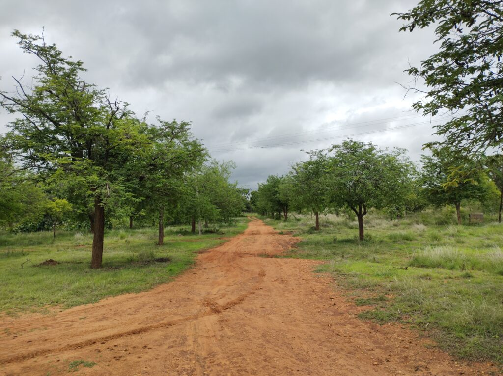
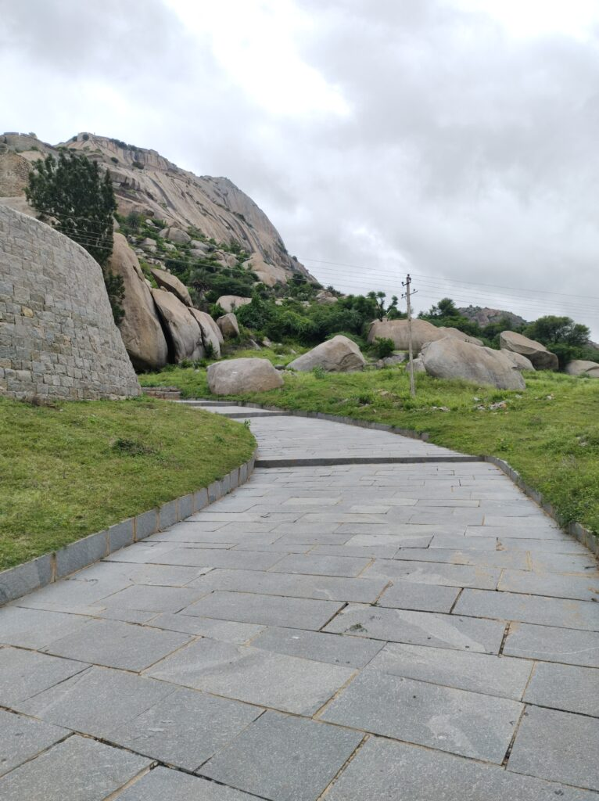
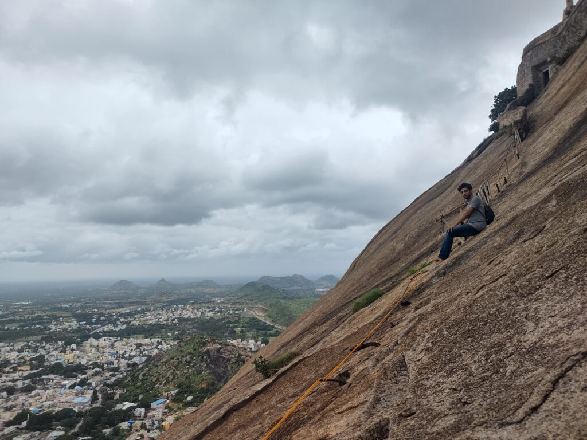

By July this year, promise had been due for a very long time. The promise I made to Aakash that we would go for a road trip.

He was back in Bengaluru for 3 months after a long gap from COVID. By end of July, he would be shifting to another city. Since he arrived, he kept asking me for a road trip. But being the lazy person I am, I kept throwing excuses one after the other.

I had to find a good destination for a one-day trip. A Twitter thread listing one day trekking destinations from Bengaluru came to my aid at right time. Madhugiri looked perfect. It's about 105km from Bengaluru and suitable for beginners. TripAdvisor told me that those who go that far should not miss Jayamangali Blackbuck Conservation Reserve. “Blackbucks? Wow!” I thought.

So, the plan was set, supplies (chips, chocolates, biscuits etc.) were procured, car was serviced, and we were ready; He more than I 😂

Our trip started at 6am from near Doddakallasandra metro station on Kanakapura Road. NICE road toll plaza is around 2-3km from there. It didn't take much time to exit the NICE road onto Tumkur Road. Monsoon had just set in. It was a cloudy morning with drizzles here and there. By 7am we stopped for breakfast a few kilometers before Dabaspet.

First stop was Jayamangali Black Buck Conservation Reserve. After taking a diversion from Tumkur Road at Dabaspet, we were on to a much quieter road towards our destination. Drive was pleasant. From some reviews on the internet, I knew that if we reached the Reserve by 8am we could hope to see some black bucks.

I was expecting an entrance, some entry fee, some guards and at least some other visitors like us. An arch with no guard and no fence on either side welcomed us. It’s a very large grassland with sparsely spread bushes. Due to the Monsoon, it was green as far as we could see. As we entered the arch, we found one more car parked there. We were not alone, after all.

It was a pleasant walk inside the Reserve with no human beings and no black bucks either. A couple of peacocks peaked out from the bushes. A rabbit hurriedly jumped across the mud road and disappeared. We walked for about half an hour and then decided to drive inside the Reserve as it appeared too large to cover by foot. But there were no black bucks to see. By 10am we decided there was no point prolonging our stay there and took leave to Madhugiri.

<figure>

<figcaption>

Inside Jayamangali Blackbuck reserve

</figcaption>

</figure>

It is about 20km from there. On the way, Akash was experiencing a bit of nausea. So, we stopped near a village and went hunting for lemons. Only after sniffing a lemon did he feel OK to continue the journey. By 11am we were at the base of Madhugiri Fort. Security guard at the entrance asked us to show our ID cards and wrote down our vehicle number in his registry. He told us we could park our car at the base of the hill and said it would take around 2 hours to go to the peak and come back. Based on what we could see form the base, we thought we could do that in 1.

So, our climbing started.

<figure>

<figcaption>

at the foot of the hill

</figcaption>

</figure>

There were not many tourists at the time. It was still cloudy. It's a steep rocky hill and at some places is slippery too. There are barricades, steel supports and ropes at some places to help the tourists. No sooner did we start climbing than we realized that we were deceived by the appearance of the Hill.

It does not reveal itself completely at first. It tricks you into believing that what you see is all there is and. Only when you reach that “peak”, will you be shown the next part of the hill. It is like a computer video game. Only when you complete a stage will you be shown what is the next stage. And only the next stage. It must have been some half an hour since we started climbing when Akash said he could climb no more. We rested for a while and spoke with some college students who were on their way back from the peak. It was fun to watch some monkeys who were posing for photographs. Or was it the monkey that had the DSLR? 😉 I am not sure now.

After a few minutes, I told him I was going to climb further and see where it takes me. Hence my lone journey started. A brief rest had restored my energy. Before long I was breathless. But I kept climbing. When I could not, I crawled. But forward I went.

<figure>

<figcaption>

Halfway to peak - Madhugiri Hills

</figcaption>

</figure>

As I climbed a voice kept running in my head. A voice that during a guided meditation session asked me to imagine climbing a steep mountain. A voice that asked me to imagine and feel the cold breeze as I climbed higher and higher, to feel the breathlessness. A voice that asked to me to imagine reaching the peak and asked me how I felt having climbed it. While I practiced the guided meditation, it did not really make much difference. But, that day as I kept climbing, all that came back to me. It was meditative in itself. I was consumed by it. By the breeze, by the breathlessness, by the tiredness but also by the desire to reach the peak. As I climbed, houses appeared tinier and tinier. I could see farther. I could see snake-like roads that took people everywhere. Neighboring hills appeared shorter.

The Hill kept revealing more and more of itself as I tried conquering it. It felt as though we were on a duel. I had to win; win I did at last. I fall short of words to describe what I really felt at that moment. It felt as though a heavy object was suddenly taken off of my shoulder. The sense of relief and achievement rushed in.

There is a small stone “_mantapa_” at the peak. One can walk through it to reach other side of the hill. I found a quiet place and sat there trying to take in all that my eyes could see.

https://youtu.be/s1DqnkZiTVk

I must have sat there for about 20 minutes. I do not know. I joined Akash about half-way back. By the time we reached the foot of the hill it was around 1pm; just like the security guard had told us.

We stopped right after Dabaspet at Hotel Udupi Grand for lunch. There was heavy rain as we drove back to Bengaluru. But it did not matter. The promise was kept, and the peak was conquered.
