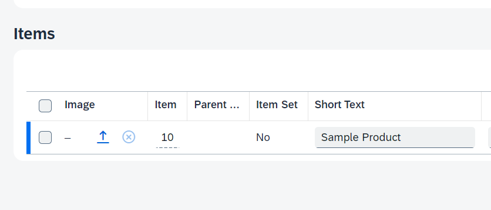
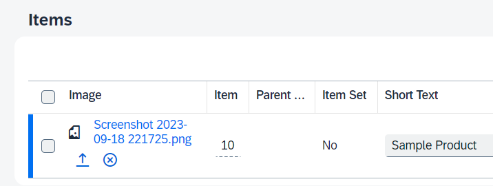
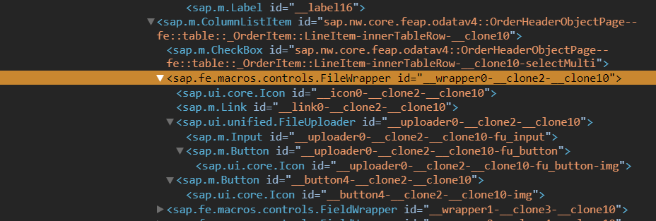
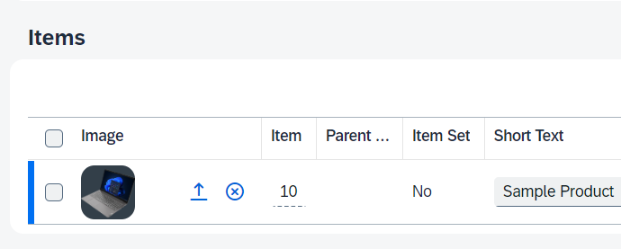
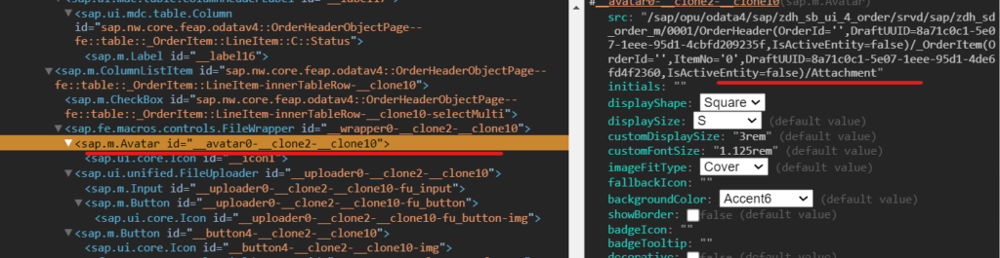
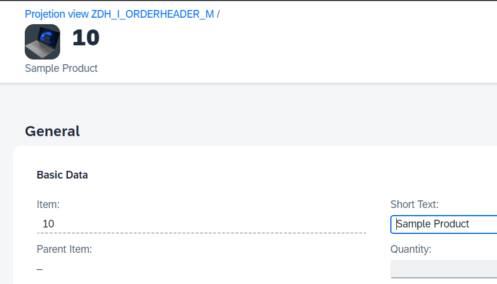

In this post I will show you how you can show images on tables as well as object page headers on a Fiori Elements List Report Object Page application using annotations.

We will build this using LOBs in RAP CDS with the help of annotations. This involves no ABAP or Javascript coding! (That would be a lie if you consider buildng the RAP application itself. But, I assume you already have one and simply looking to add an image to your table).

#### Prerequisite

Basic knowledge of working with RAP Managed business objects with draft and working with UI annotations.

## Database Table

For this example, let's assume we have a Order Header and Order Item tables with Order Item table containing below fields

```abap
@EndUserText.label : 'Order Item'
@AbapCatalog.enhancement.category : #NOT_EXTENSIBLE
@AbapCatalog.tableCategory : #TRANSPARENT
@AbapCatalog.deliveryClass : #A
@AbapCatalog.dataMaintenance : #RESTRICTED
define table zdh_t_order_item {

  key mandt      : abap.clnt not null;
  key order_id   : ebeln not null;
  key item_no    : ebelp not null;
  parent_item_no : ebelp;
  isoutline      : abap_boolean;
  description    : abap.char(50);
  @Semantics.quantity.unitOfMeasure : 'zdh_t_order_item.order_unit'
  quantity       : abap.quan(5,0);
  order_unit     : abap.unit(3);
  @Semantics.amount.currencyCode : 'zdh_t_order_item.currency'
  net_price      : abap.curr(12,2);
  currency       : abap.cuky;
  status         : abap.char(10);
.
.
.

}
```

Let's add 3 more fields to this table so that we can also store the image RAW data, file name and mimetype. Image content field should have a RAWSTRING type with length 0 - length 0 ensures that there is no restriction imposed by our own applicaton on the size of the image file at database layer. We may of-course write some validaions on RAP layer to throw some error messge.

FileName and MimeType fields are of type CHAR128.

```abap
@EndUserText.label : 'Order Item'
@AbapCatalog.enhancement.category : #NOT_EXTENSIBLE
@AbapCatalog.tableCategory : #TRANSPARENT
@AbapCatalog.deliveryClass : #A
@AbapCatalog.dataMaintenance : #RESTRICTED
define table zdh_t_order_item {

  key mandt      : abap.clnt not null;
  key order_id   : ebeln not null;
  key item_no    : ebelp not null;
  parent_item_no : ebelp;
  isoutline      : abap_boolean;
  description    : abap.char(50);
  @Semantics.quantity.unitOfMeasure : 'zdh_t_order_item.order_unit'
  quantity       : abap.quan(5,0);
  order_unit     : abap.unit(3);
  @Semantics.amount.currencyCode : 'zdh_t_order_item.currency'
  net_price      : abap.curr(12,2);
  currency       : abap.cuky;
  status         : abap.char(10);
  attachment     : zdh_e_attah_content;
  mimetype       : zdh_e_mimetype;
  filename       : zdh_e_filename;
.
.
.

}
```

## CDS Entity Changes

You may be directly selecting from database table into your transactional processing (TP) views of RAP application OR there may be multiple layers of Basic and Composite CDS views. If the latter is the case, then make sure the above 3 fields are also added to all those intermediary CDS views.

Another interesting option would be to have a separate table for images with item key fields as foreign keys and then create a 1:1 association from RAP transactional processing view to bring those image fields into our RAP model. I have not tried this, but this is also an option in case you cannot change the existing DB table and intermediate Basic and Composite views.

Also, in many cases, such images may not be directly added in a so called `OrderItem` entity. They may very well be part of a `ProductMaster` entity. So, your requirement may be to show the image of a selected product on `OrderItem` table/object page header. As long as you use the annotations shown in this post, it should not be very difficult to achieve this.

To keep things simple, I hadded the fields to my RAP TP views as below. Important point here is the annotation `@Semantic.largeObject`.

This tells RAP framework that the field `attachment` holds a LOB content and its mimeType is stored in field `MimeType` and its fileName is stored in field `FileName`. That is all you have to do. Rest is taken care by 'RESTfull' framework. (Is that why it is called RESTful? That you have to do very little and the 'REST' is handle by the framework?).

```abap
@AbapCatalog.viewEnhancementCategory: [#NONE]
@AccessControl.authorizationCheck: #NOT_REQUIRED
@EndUserText.label: 'Basic CDS view for Order Item'
@Metadata.ignorePropagatedAnnotations: true
@ObjectModel.usageType:{
    serviceQuality: #X,
    sizeCategory: #S,
    dataClass: #MIXED
}
define view entity ZDH_I_OrderItem_M
  as select from ZDH_I_OrderItemBasic

  association to parent ZDH_I_OrderHeader_M as _Order on $projection.OrderId = _Order.OrderId
{
  key OrderId,
  key ItemNo,
.
.
.

      @Semantics.largeObject:{
        mimeType: 'MimeType',
        fileName: 'FileName',
        contentDispositionPreference: #ATTACHMENT
      }
      Attachment,
      MimeType,
      FileName,
.
.
.

      _Order
}

```

I imagine you already know how to add the required annotations to get a List Report Object Page Fiori Elements applications running and how to create a Service Definition and Service binding. In this case, I am using ODATA V4 UI service binding type.

## App Preview

When we preview this app now, this how we see this in Edit mode. We can upload an image file. But you will notice that it does not show the image yet. Instead you will only see the file name!



After uploading the image, this is how we see it



## What went wrong?

Nothing! But, an LOB could be just about any binary content. Fiori Elements does not know that it contains an image. It could be a PDF file, an Excel file or something else. So, there should be a way to tell Fiori Elements that "Hey! 'attachment' field contains an image. So, render it using `sap.m.Image` or `sap.m.Avatar`".

Looking into [UI5 inspector](https://chrome.google.com/webstore/detail/ui5-inspector/bebecogbafbighhaildooiibipcnbngo), we see that there is only a generic FileWRapper building block used to show this.



In your consumption view, add annotation `@Semantics.imageUrl: true` to `attachment` field. Note, you cannot add this annotatin in the Meta Data Extension (MDE) file.

```abap
@EndUserText.label: 'Projetion view ZDH_I_OrderItem_M'
@AccessControl.authorizationCheck: #NOT_REQUIRED
@Metadata.allowExtensions: true
define view entity ZDH_C_OrderItem_M
  as projection on ZDH_I_OrderItem_M
{
  key OrderId,
  key ItemNo,
      .
      .
      .
      @Semantics.imageUrl: true
      Attachment,
      MimeType,
      FileName,
      .
      .
      .

      /* Associations */
      _Order : redirected to parent ZDH_C_OrderHeader_M
}

```

After this, if you refresh the app, you will see the imgae. This annotation tells Fiori Elements that the file indeed is an image so that it knows how to render it!



If you inspect it now using UI5 inspector, you will see that the file is wrapped within in a `sap.m.Avatar` control whose `src` property is bound to `Attachment` field



## How to show the image on the Item Object Page header?

This is just a matter of one annotation after having done all these. Within the MDE of Item entity, add the annotation `@UI.headerInfo.imageUrl` and point it to `Attachment` field

```abap
@Metadata.layer: #CORE
@UI.headerInfo: {
    title: {
        value: 'ItemNoForEdit'
    },
    description: {
        value: 'Description'
    },
    imageUrl: 'Attachment'
}
annotate view ZDH_C_OrderItem_M with
{
  @UI.facet: [
     { id: 'GeneralFacet', label: 'General', type: #COLLECTION, position: 10 },
         { id: 'BasicDataFGR', label: 'Basic Data', type: #FIELDGROUP_REFERENCE, parentId: 'GeneralFacet', targetQualifier: 'BasicFG' },
         { id: 'AdminDataFGR', label: 'Admin',      type: #FIELDGROUP_REFERENCE, parentId: 'GeneralFacet', targetQualifier: 'AdminFG' }
  ]

//  OrderId;
//  ItemNo;
//
}
```

If you navigate to item's object page now, you will see the image like this



Complete source code of this is available in this [GitHub repo](https://github.com/dhananjayhegde/abap-rap-samples-new/tree/main/src/zdh_rap_aunits). Refer to directory `ZDH_RAP_AUNITS` (package). You can import this codebase into your ADT using `abapGit`. [How to connect your ABAP environment on BTP to abapGit](https://developers.sap.com/tutorials/abap-environment-abapgit-transfer.html) is explained here.

That's a wrap for now. Hope you liked it and will find it useful.
