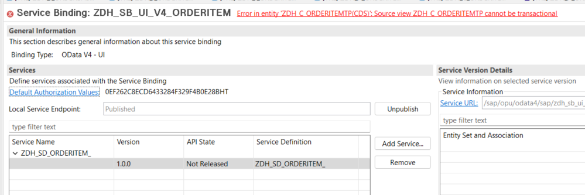
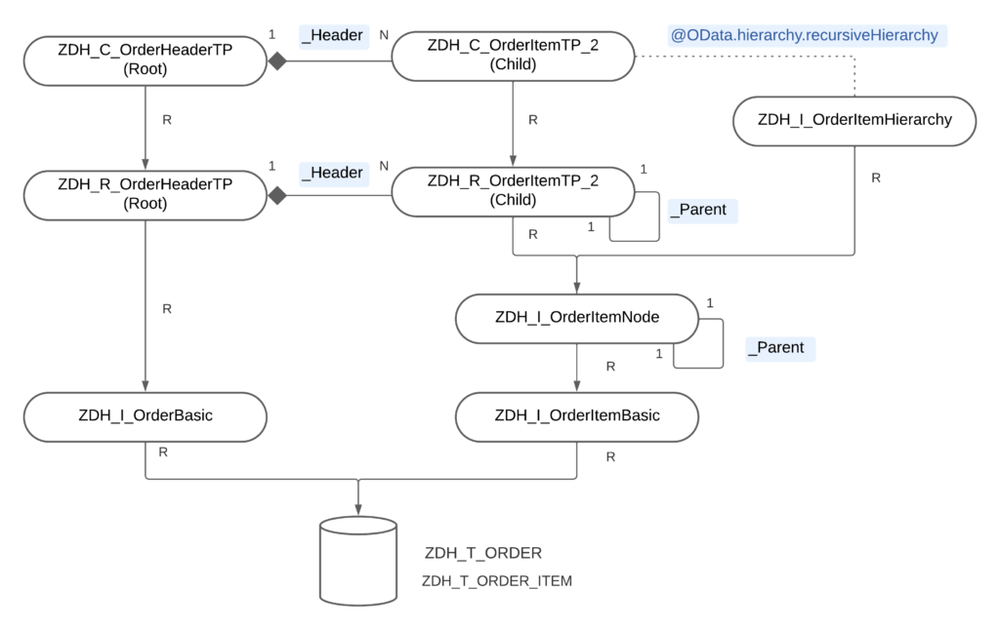
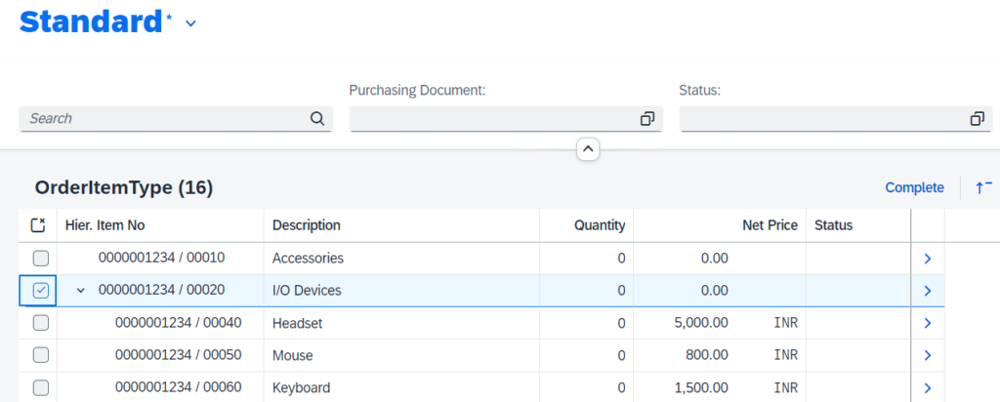

We we will continue from where we left off at in the previous post. If you have not seen it yet, then check it out here - [Show Hierarchy on Fiori Elements List Report Page with RAP + ODATA V4](https://dhananjayhegde.in/2023/11/show-hierarchy-on-fiori-elements-list-report-page-with-rap-odata-v4/)

With S/4 HANA Cloud 2311 release, hierarchy with one click actions are supported on ODATA V4. To add actions, we use RAP BDEF (Behavior Definition). We will dicuss some limitations that exist as of 2311, some errors we may see etc.

All these objects are created and tested on BTP Trial account as of today when this post was first published i.e. on November 20, 2023. All ABAP source code used here are available in this [Git Repo](https://github.com/dhananjayhegde/abap-rap-samples-new). Feel free to clone it using [abapGit](https://abapgit.org/) and use it for testing. All the objects created for this specific post are available in package **ZDH\_V4\_HIER\_ACTIONS**.

## Initial Hurdle

In the previous post, we discussed read-only application with hierarchy. We will create a BDEF for the same root CDS views viz. `ZDH_R_OrderItemTP` and `ZDH_C_OrderItemTP`. There is nothing fancy here. Also, since only actions are supported, we disable standard CUD operations and add an instance action `SetToComplete` whose implementation does not matter at this moment.

```
managed implementation in class zcl_bp_dh_r_orderitemtp unique;
strict ( 2 );

define behavior for ZDH_R_OrderItemTP alias OrderItem
persistent table zdh_t_order_item
lock master
authorization master ( instance )
etag master LastChangedAt
{
  //  create;
  //  update;
  //  delete;

  field( readonly ) OrderId, ItemNo;

  action SetToComplete;

  mapping for zdh_t_order_item corresponding
    {
      ...
    }
}
```

If we now try to open our Service Biniding, we see an error - "**Error in entity 'ZDH\_C\_ORDERITEMTP(CDS)': Source view ZDH\_C\_ORDERITEMTP cannot be transactional**".



It means exactly what you think it means i.e. becasue there is a Behavior Definition which adds transactional behavior to which was hitherto a read-only application, we get this error. But, hey! wait. We thought it is supported now, didn't we?

There is a catch! and that is the limitation as of now. Though it may be, I hope, removed in a future release.

## RAP BO with non-hierarchical entity as Root

To be able to add actions and hence transactional behavior to a hierarchy based application, we need to have a root entity which does not expose any "modify" behaviors i.e. does not expose create, update, delete operations nor any actions! Yes, you read it right! This means, we need to add a dummy root entity, let's call it `OrderHeader` and make `OrderItem` a child entity.

To not to disturb the existing read-only application for someone who is referring to it from future, I will create a new package and create new set of CDS views and entities in it for the purpose of this post. In the end, data model would look like this. We are reusing some CDS views created from the previous post.



To keep the post succinct, I will not post the code snippets of all these CDS entities here again. Important points to note/differences from those created in previous post are:

- `OrderItem` is not root entity anymore. Instead, `OrderHeader` is the root entity

- When we create BDEF, `OrderHeader` entity should not expose any Create, Update, Delete operation nor can it contain any actions!

- We do not expose the `OrderHeader` in our service definition, only `OrderItem` is sufficient

- Since we want to show the hierarchy on List Report page, CDS Hierarchy `ZDH_I_OrderItemHierarchy` does not have a `directory`

- Make sure `ZDH_C_OrderItemTP_2` has the annotation `@OData.hierarchy.recursiveHierarchy` with value `[{entity.name: 'ZDH_I_OrderItemHierarchy'}]`

Our BDEF looks like this - we add one action to `OrderItem` entity named `SetToComplete`. Implementation does not matter at the moment. Some parts of the code are obscured for brevity:

```
managed implementation in class zcl_bp_dh_r_orderheadertp unique;
strict ( 2 );

define behavior for ZDH_R_OrderHeaderTP alias OrderHeader
persistent table zdh_t_order
lock master
authorization master ( instance )
etag master LastChangedAt
{
  //  create;
  //  update;
  //  delete;

  field ( readonly ) OrderId;
  association _Item;
  mapping for zdh_t_order corresponding
    {
     ...
    }
}

define behavior for ZDH_R_OrderItemTP_2 alias OrderItem
persistent table zdh_t_order_item
lock dependent by _Header
authorization dependent by _Header
etag master LastChangedAt
{
  //  update;
  //  delete;

  field ( readonly ) OrderId, ItemNo;

  action SetToComplete;

  association _Header;

  mapping for zdh_t_order_item corresponding
    {
      ...
    }
}
```

Do not forget to expose the action in BDEF `ZDH_C_OrderHeaderTP`. And also add required `@UI` annotations to CDS view or MDE (Meta Data Extension) to show the action on the list report:

```
@EndUserText.label: 'Order Item Projection'
@AccessControl.authorizationCheck: #NOT_REQUIRED
@Search.searchable: true

@OData.hierarchy.recursiveHierarchy: [{entity.name: 'ZDH_I_OrderItemHierarchy'}]
define view entity ZDH_C_OrderItemTP_2
  as projection on ZDH_R_OrderItemTP_2
{
      
      @UI.selectionField: [{ position: 10 }]
  key OrderId,
  key ItemNo,

      @UI.lineItem: [
        { position: 10, label: 'Hier. Item No' },
        { type: #FOR_ACTION, dataAction: 'SetToComplete', position: 10, label: 'Complete', invocationGrouping: #CHANGE_SET }
      ]
      FormattedItemNo,
      ParentItemNo,
      ...
}
```

And Service Definition would look like this - it exposes only the `OrderItem` entity:

```
@EndUserText.label: 'Service Definition for Order with Manage BDEF'
define service ZDH_SD_ORDERITEM_HIER_ACT {
  expose ZDH_C_OrderItemTP_2 as OrderItem;
}
```

Create a service binding for this with Biding type "OData V4 - UI" and publish it. I have named it "ZDH\_SB\_UI\_V4\_ORDERITM\_HIER\_ACT". With this, if we now preview the app from Service Binding, we should be able to see the hierarchy on list report page along with the action.



## Fiori Elements Application

If you want to, most porbably you will, generate a Fiori Elements app and show the hierarchy on the list report, follow the same steps as described in the [previous post](https://dhananjayhegde.in/2023/11/show-hierarchy-on-fiori-elements-list-report-page-with-rap-odata-v4/).

That's a wrap for now. Let me know how you enjoyed this post and also if you have tried this. If yes, what was your experience with hierarchy + actions. What actions did you implement and if you faced any specific issues.

Also some food for thought -

- When a parent item is selected and an action is executed which internally applies the action to all the descendant items (not just immediate child items) and you want to refresh the affected fields (say, `Status`) for the selected parent item as well all the affected descendant items automatically without having to click on "Go" button or page refresh - how would you do that? let me know your thoughts in the comment - I will write a post on that some time in the future!

Cheers!
