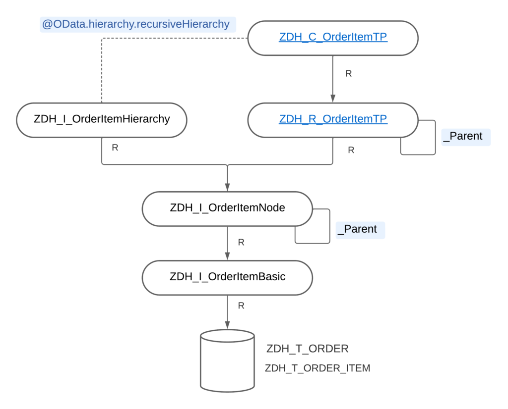
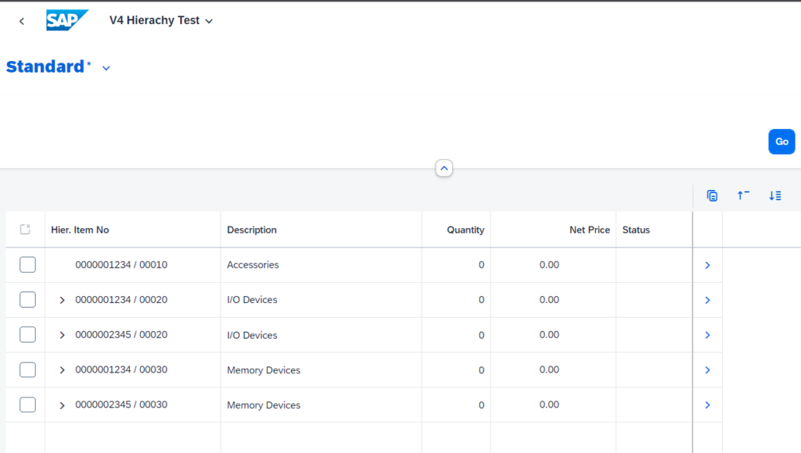
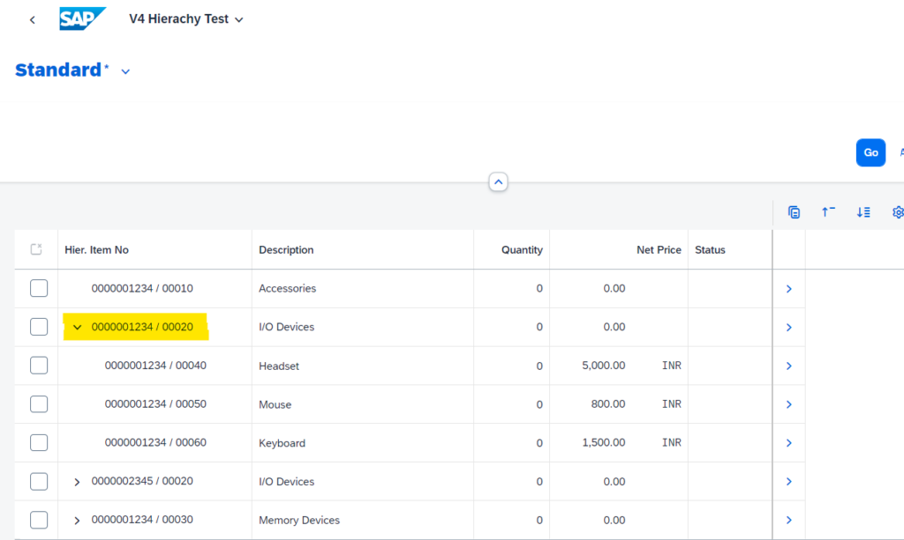

With S/4 HANA 2308 Cloud release, ABAP and Fiori Elements support ODATA V4 hierarchy based applications with read-only capabilities. In this post, we will discuss how to show such a hierarchy on the List Report page of a Fiori Elements application.

All these objects are created and tested on BTP Trial account as of today when this post was first published i.e. on November 19, 2023. All ABAP source code used here are available in this [Git Repo](https://github.com/dhananjayhegde/abap-rap-samples-new). Feel free to clone it using [abapGit](https://abapgit.org/) and use it for testing!

## Ground Work

For this demo, we will create a single table named `zdh_t_order_item` which has, most importantly, a field `parent_item_no` that contains the value of the parent item in an item heirarhcy. We will use this to create the parent-child relationship between items.

This table looks like this:

```abap
@EndUserText.label : 'Order Item'
@AbapCatalog.enhancement.category : #NOT_EXTENSIBLE
@AbapCatalog.tableCategory : #TRANSPARENT
@AbapCatalog.deliveryClass : #A
@AbapCatalog.dataMaintenance : #RESTRICTED
define table zdh_t_order_item {

  key mandt      : abap.clnt not null;
  key order_id   : ebeln not null;
  key item_no    : ebelp not null;
  parent_item_no : ebelp;
  isoutline      : abap_boolean;
  description    : abap.char(50);
  @Semantics.quantity.unitOfMeasure : 'zdh_t_order_item.order_unit'
  quantity       : abap.quan(5,0);
  order_unit     : abap.unit(3);
  @Semantics.amount.currencyCode : 'zdh_t_order_item.currency'
  net_price      : abap.curr(12,2);
  currency       : abap.cuky;
  status         : abap.char(10);
  attachment     : zdh_e_attah_content;
  mimetype       : zdh_e_mimetype;
  filename       : zdh_e_filename;
  admin          : include zdh_s_admin;

}
```

Now, create a CDS view that makes up the Node of our hierarchy. Also define an association `_Parent` that signifies the relationship between parent and child items. Name of this association can be anything.

```abap
@AbapCatalog.viewEnhancementCategory: [#NONE]
@AccessControl.authorizationCheck: #NOT_REQUIRED
@EndUserText.label: 'Hierarchy Node For Order Item'
@Metadata.ignorePropagatedAnnotations: true
@ObjectModel.usageType:{
    serviceQuality: #X,
    sizeCategory: #S,
    dataClass: #MIXED
}
define view entity ZDH_I_OrderItemNode
  as select from ZDH_I_OrderItemBasic

  association to ZDH_I_OrderItemNode as _Parent on  $projection.OrderId      = _Parent.OrderId
                                                and $projection.ParentItemNo = _Parent.ItemNo
{
  key OrderId,
  key ItemNo,
      ParentItemNo,
      Description,
      @Semantics.quantity.unitOfMeasure: 'OrderUnit'
      Quantity,
      OrderUnit,
      @Semantics.amount.currencyCode: 'Currency'
      NetPrice,
      Currency,
      Status,

      _Parent
}

```

You may ignore the CDS view `ZDH_I_OrderItemBasic`and choose to directly select from the table. It will not make any difference to the end result.

Here, `_Parent` association is important. Also, this CDS view will be used as a source for both RAP transactional processing CDS view and the CDS Hierarchy.

## CDS Hierarchy - ZDH_I_OrderItemHierarchy

Create a CDS Hierarchy by selecting from the CDS View creatred above. Note that

- This need not contain all the elements from the source CDS View. Only those elements/fields that are required to create the hierarchy are sufficient

- Do not expose the `_Parent` association from this. Doing so will casue a syntax error while creating service binding

- Make sure to add a `start where` condition that qualifies the root of every item hierarchy. In our case, it is `ParentItemNo` is initial i.e. every item that has no parent becomes a root node of a hierarhcy

- We have `siblings order by` as `ItemNo`. This can also be some other field which is used for this specific purpose. For example, for Purchase Order or Purchase Contract, field `EXSNR` (`ExternalSortNumber`) from table `EKPO` is used for this. This is used to sort the child items that are under a given parent

It looks like this in our case - `ZDH_I_OrderItemHierarchy`

```abap
@EndUserText.label: 'Order Item Hierarchy'
@AccessControl.authorizationCheck: #NOT_REQUIRED
define hierarchy ZDH_I_OrderItemHierarchy
  as parent child hierarchy(
    source ZDH_I_OrderItemNode
    child to parent association _Parent
    start where
      ParentItemNo is initial
    siblings order by
      ItemNo
    multiple parents not allowed
  )
{
  key OrderId,
  key ItemNo,
      ParentItemNo
}
```

### Note

We did not add `directory` option to CDS Hierarchy definition because we want to show the item hierarchy on list report page. In fact, we could have a `OrderHeader` entity as root and still be able to show hierarchy on list report page. Most important part is to NOT add the `directory` option. Read till the end for performance considerations.

## Transactional Processing and Projection Views

### ZDH_R_OrderItemTP

- Create a transactional processing `root` view entity which will be used to create RAP Behavior Definition later - `ZDH_R_OrderItemTP`

- This must select from the same source view as that of the CDS Hierarchy i.e. - `ZDH_I_OrderItemNode`

- Recreate the `_Parent` association in `ZDH_R_OrderItemTP` which points to itself

- Here we add a calculated field `FormattedItemNo` which will be used to show Order Number and Item Number concatenated (this is not really necessary for hierarhcy), just a nice touch!

```abap
@AccessControl.authorizationCheck: #NOT_REQUIRED
@EndUserText.label: 'Root View for Order Item Entity'
define root view entity ZDH_R_OrderItemTP
  as select from ZDH_I_OrderItemNode

  association to ZDH_R_OrderItemTP as _Parent on  $projection.OrderId      = _Parent.OrderId
                                              and $projection.ParentItemNo = _Parent.ItemNo
{
  key OrderId,
  key ItemNo,
      concat_with_space( concat_with_space( OrderId, '/', 1 ), ItemNo, 1 ) as FormattedItemNo,
      ParentItemNo,
      Description,
      Quantity,
      OrderUnit,
      NetPrice,
      Currency,
      Status,

      /* Associations */
      _Parent
}
```

### ZDH_C_OrderItemTP

- Create this as a projection view selecting from `ZDH_R_OrderItemTP`

- Most important thing in this is the annotation `**@OData.hierarchy.recursiveHierarchy**` that points to the CDS hierarchy we created above - some parts are obscured for brevity

```abap
@EndUserText.label: 'Projection View for Order Item entity'
@AccessControl.authorizationCheck: #NOT_REQUIRED

@OData.hierarchy.recursiveHierarchy: [{entity.name: 'ZDH_I_OrderItemHierarchy'}]

define root view entity ZDH_C_OrderItemTP
  provider contract transactional_query
  as projection on ZDH_R_OrderItemTP
{
  key OrderId,
  key ItemNo,

      @UI.lineItem: [{ position: 10, label: 'Hier. Item No' }]
      FormattedItemNo,
      ParentItemNo,
      .
      .
      .

      /* Associations */
      _Parent: redirected to ZDH_C_OrderItemTP
}
```

At this moment, our resulting data model looks like this



## Service Exposure

Create a service definition. Add only the transactional processing projection entities to it. No need to expose the CDS Hierarchy as part of the service. It looks like this in our case:

```abap
@EndUserText.label: 'Service Definition for Order Item'
define service ZDH_SD_OrderItem_ {
  expose ZDH_C_OrderItemTP as OrderItem;
}
```

Create a Service Binding with Binding Type "ODATA V4 - UI" and then publish it.

### Note

"Preview"ing the app from Service Binding already shows the hierarchy. However, when we generate a List Report application from this service, table on the List Report page, by default, uses `ResponsiveTable` which does not show the hierarchy like we expect. Read further to know how to achieve this.

## Fiori Elements Application - manifest.json

Header over to BAS or whichever editor you want to use and generate a Fiori Elements List Report Object Page application from this service binding created above. Next, we add below code snippet to `tableConfiguration` object of List Report table's `settings` object in `manifest.json`

- Default table type of list report is `ResponsiveTable`. We change that to `TreeTable`

- Add the property `hierarchyQualifier` and point that to the CDS hierarchy we created above - `ZDH_I_OrderItemHierarchy`

Some code is removed for brevity:

```json
          "targets": {
                "OrderItemList": {
                    "type": "Component",
                    "id": "OrderItemList",
                    "name": "sap.fe.templates.ListReport",
                    "options": {
                        "settings": {
                            "controlConfiguration": {
                                "@com.sap.vocabularies.UI.v1.LineItem": {
                                    "tableSettings": {
                                        "type": "TreeTable",
                                        "hierarchyQualifier": "ZDH_I_OrderItemHierarchy",
                                        "selectionMode":"Multi"
                                    }
                                }
                            },
                            ...
                        }
                    }
                },
                ...
            }
```

With this, we are all set to run the application. Note that, as of 2308, ODATA V4 supports read-only application with hierarchy. A Behavior Definition with only "one-click" actions are expected to be supported from 2311 release. We will see that in next post.

## Test data

We can use a class to fill some test data so that we can verify the hierarchy display. I added this class `ZDH_HIERARCHY_FILL_DATA` which creates data for two orders with some items:

Code snippet is shortened for brevity:

```abap
    SELECT * FROM zdh_t_order_item INTO TABLE @lt_orderitem.
    IF sy-subrc = 0.
      DELETE zdh_t_order_item FROM TABLE @lt_orderitem.
    ENDIF.

    lt_orderitem = VALUE #(
        ( order_id = '0000001234' item_no = '00010' description = 'Accessories' isoutline = abap_true )

        ( order_id = '0000001234' item_no = '00020' description = 'I/O Devices' isoutline = abap_true )
            ( order_id = '0000001234' item_no = '00040' description = 'Headset'   parent_item_no = '00020'    net_price = 5000    currency = 'INR' )
            ( order_id = '0000001234' item_no = '00050' description = 'Mouse'     parent_item_no = '00020'    net_price = 800     currency = 'INR' )
            ( order_id = '0000001234' item_no = '00060' description = 'Keyboard'  parent_item_no = '00020'    net_price = 1500    currency = 'INR' )

        ( order_id = '0000001234' item_no = '00030' description = 'Memory Devices' isoutline = abap_true )
            ( order_id = '0000001234' item_no = '00070' description = 'Hard disk' parent_item_no = '00030'    net_price = 3500    currency = 'INR'  )
            ( order_id = '0000001234' item_no = '00080' description = 'USB Drive' parent_item_no = '00030'    net_price = 350     currency = 'INR' )


        ( order_id = '0000002345' item_no = '00020' description = 'I/O Devices' isoutline = abap_true )
            ( order_id = '0000002345' item_no = '00040' description = 'Headset'   parent_item_no = '00020'    net_price = 5000    currency = 'INR' )
            ( order_id = '0000002345' item_no = '00050' description = 'Mouse'     parent_item_no = '00020'    net_price = 800     currency = 'INR' )
            ( order_id = '0000002345' item_no = '00060' description = 'Keyboard'  parent_item_no = '00020'    net_price = 1500    currency = 'INR' )

        ( order_id = '0000002345' item_no = '00030' description = 'Memory Devices' isoutline = abap_true )
            ( order_id = '0000002345' item_no = '00070' description = 'Hard disk' parent_item_no = '00030'    net_price = 3500    currency = 'INR'  )
            ( order_id = '0000002345' item_no = '00080' description = 'USB Drive' parent_item_no = '00030'    net_price = 350     currency = 'INR' )
            ( order_id = '0000002345' item_no = '00060' description = 'Keyboard'  parent_item_no = '00030'    net_price = 1500    currency = 'INR' )
            ( order_id = '0000002345' item_no = '00090' description = 'Keyboard'  parent_item_no = '00030'    net_price = 1500    currency = 'INR' )
    ).

    MODIFY zdh_t_order_item FROM TABLE @lt_orderitem.

    out->write( |{ sy-dbcnt } rows modified| ).
```

With this, if we run the fiori application, we see something like this:



We can expand the hierarchy items to see their sub items



## Performance Considerations

- Normally, if we want to display the item hierarchy on an object page of, say, `OrderHeader`, then we would have used the `OrderId` as the directory

- This limits the number of items to be considered to construct the hierarchy to that of the specific order whose object page is being displayed

- It would be highly unlikely that we will have Orders with millions of items each!

- However, since we have the hierarchy on list report and because of which we cannot have `directory`, every time the list report page is loaded, ALL items from the underlying table will be considered for hierarchy construction. This operation is very costly. We should be concerned if there are going to be more than a million items in total in the underlying table, which is very likely!

- So, to overcome this, we need to add some `WHERE` clause to the source CDS view of the hierarchy - `ZDH_I_OrderItemNode`. This will limit the number of items that are considered for hierarchy construction

- Note that such a `WHERE` caluse

  - **SHOUDL NOT** break the hierarchy i.e. removing some parent items that may have valid child items - this can create orphan nodes

  - May end up creating empty parent items where none of the child items match the conditions of the WHERE clause

All these should be considered before/during the development of such an application!

I hope you enjoyed this post. Give a thumbs-up and drop a comment on what you think and what has been your experience with hierarchy related developments. Cheers!
